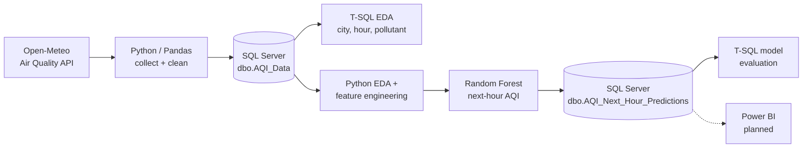

# india-air-quality-analytics-ml
End-to-end India AQI analytics: API → Python → SQL Server → EDA → Random Forest next-hour prediction


# 🌫️ India Air Quality Analytics & Next-Hour AQI Prediction

End-to-end data analytics and machine learning project covering **50 Indian cities**: hourly air-quality data is collected from an API, cleaned with Python, stored and analysed in **SQL Server**, explored with EDA, and used to train a **Random Forest** model that predicts the **next-hour US AQI**.


---

## 📌 Table of Contents
- [Project Overview](#-project-overview)
- [Key Results](#-key-results)
- [Architecture](#-architecture)
- [Dataset](#-dataset)
- [Repository Structure](#-repository-structure)
- [Tech Stack](#-tech-stack)
- [Getting Started](#-getting-started)
- [Methodology](#-methodology)
- [Key Insights](#-key-insights)
- [Model Performance](#-model-performance)
- [Limitations](#-limitations)
- [Future Work](#-future-work)
- [Author](#-author)

---

## 🎯 Project Overview

**Business questions answered**
1. Which cities and states have the worst and best air quality?
2. Which pollutants drive poor AQI in each region?
3. How does AQI change by hour of day and day of week?
4. Can we predict the AQI of the **next hour** from current pollutant levels and time features?

**Skills demonstrated:** API data ingestion · data cleaning and validation · T-SQL analytics · EDA and outlier analysis · feature engineering · time-aware model validation · hyperparameter tuning · model evaluation in SQL.

---

## 🏆 Key Results

| Metric | Value |
|---|---|
| Cities covered | **50** (across 22 states / UTs) |
| Hourly records | **54,000** (1,080 per city) |
| Period | 1 Aug 2026 → 14 Sep 2026 |
| Best model | Tuned **Random Forest** |
| MAE / RMSE / R² | **9.35** / **13.17** / **0.8257** |
| Predictions within ±10 AQI | **65.69%** |
| Predictions within ±20 AQI | **88.83%** |
| Most polluted city (avg AQI) | **Delhi – 154.12** (peak 418) |
| Cleanest city (avg AQI) | **Mysuru – 34.54** |

---

## 🏗️ Architecture



---

## 🗂️ Dataset

- **Source:** [Open-Meteo Air Quality API](https://open-meteo.com/en/docs/air-quality-api), hourly, timezone `Asia/Kolkata`
- **Size:** 54,000 rows × 20 columns after cleaning (50 cities × 1,080 hours)
- **Variables:** `pm2_5`, `pm10`, `carbon_monoxide`, `nitrogen_dioxide`, `sulphur_dioxide`, `ozone`, `us_aqi`, plus city, state, latitude, longitude
- **Engineered columns:** `date`, `year`, `month`, `day`, `hour`, `day_of_week`, `day_name`, `aqi_category`, and in SQL `time_period` and `season`
- **Quality checks:** no missing values, no duplicate `(city, time)` pairs, perfectly balanced across cities

AQI categories follow the US EPA scale: Good (0–50), Moderate (51–100), Unhealthy for Sensitive Groups (101–150), Unhealthy (151–200), Very Unhealthy (201–300), Hazardous (300+).

> CSV files are not stored in the repo. See [`data/README.md`](data/README.md) for how to regenerate them.

---

## 📁 Repository Structure

```
india-air-quality-analytics-ml/
├── README.md
├── LICENSE
├── requirements.txt
├── .gitignore
├── notebooks/
│   ├── 01_data_collection_and_cleaning.ipynb   # API → raw CSV → clean CSV
│   ├── 02_load_data_to_sqlserver.ipynb         # CSV → SQL Server (dbo.AQI_Data)
│   └── 03_eda_feature_engineering_ml.ipynb     # SQL → EDA → features → ML → predictions
├── sql/
│   ├── 01_eda_queries.sql                      # validation + EDA + time_period/season
│   └── 02_model_evaluation.sql                 # accuracy bands, error direction, worst cases
├── data/
│   ├── README.md
│   ├── raw/
│   ├── processed/
│   └── predictions/
└── docs/
    └── images/                                 # charts / dashboard screenshots
```

---

## 🛠️ Tech Stack

| Layer | Tools |
|---|---|
| Language | Python 3.10+, T-SQL |
| Data wrangling | Pandas, NumPy, Requests |
| Visualisation | Matplotlib, Seaborn |
| Database | Microsoft SQL Server Express, SQLAlchemy, pyodbc, ODBC Driver 18 |
| Machine learning | scikit-learn (Linear Regression, Decision Tree, Random Forest, RandomizedSearchCV) |
| Environment | Jupyter Notebook |

---

## 🚀 Getting Started

### Prerequisites
- Python 3.10+
- SQL Server (Express is fine) and [ODBC Driver 18 for SQL Server](https://learn.microsoft.com/sql/connect/odbc/download-odbc-driver-for-sql-server)


### Configure the database connection
The notebooks use Windows authentication against a local instance. Change the `server` variable to match your machine:

```python
server   = r"YOUR-PC-NAME\SQLEXPRESS"
database = "AQI_Analytics"
```

Create the database once in SSMS (`CREATE DATABASE AQI_Analytics;`).

### Run order
| Step | File | Output |
|---|---|---|
| 1 | `notebooks/01_data_collection_and_cleaning.ipynb` | `aqi_clean.csv` |
| 2 | `notebooks/02_load_data_to_sqlserver.ipynb` | table `dbo.AQI_Data` |
| 3 | `sql/01_eda_queries.sql` (in SSMS) | SQL EDA, `time_period`, `season` |
| 4 | `notebooks/03_eda_feature_engineering_ml.ipynb` | model, CSV outputs, table `AQI_Next_Hour_Predictions` |
| 5 | `sql/02_model_evaluation.sql` (in SSMS) | accuracy and error analysis |

> The notebooks read and write CSVs relative to their working directory. Run them from the same folder or update the paths.
> `sql/01_eda_queries.sql` starts with `CREATE DATABASE` and ends with `ALTER TABLE`, which can only run once. Skip or comment those parts on re-runs.

---

## 🔬 Methodology

1. **Collection:** requests to Open-Meteo for 50 city coordinates, with a 1 s delay between calls and error handling per city.
2. **Cleaning and validation:** datetime conversion, duplicate and null checks, extraction of calendar features, creation of `aqi_category`.
3. **SQL analytics:** city, category, hourly, day-of-week and pollutant analysis, plus derived `time_period` and `season`.
4. **EDA:** distributions, IQR outlier analysis (2.98% for ozone to 9.19% for SO₂; outliers **kept** because they reflect real pollution events), city and state rankings, pollutant z-score heatmap, composite pollutant-burden index, geographic scatter.
5. **Feature engineering:** `is_weekend`, `is_peak_hour`, `pm25_pm10_ratio`, and cyclical encodings (`hour_sin/cos`, `dow_sin/cos`).
6. **Target:** `next_hour_aqi` = `us_aqi` shifted by −1 hour **within each city**.
7. **Validation:** **chronological 80/20 split** (train 1 Aug → 5 Sep, test 5 Sep → 14 Sep) so the model never sees the future.
8. **Modelling:** mean baseline, Linear Regression, Decision Tree, Random Forest, then `RandomizedSearchCV` (10 iterations, 3-fold CV).
9. **Evaluation:** MAE, RMSE, R², feature importance, then error analysis in SQL.

---

## 💡 Key Insights

**Geography**
- The **Indo-Gangetic plain and Punjab** carry the heaviest load: Delhi (154.12), Amritsar (146.98), Ludhiana (146.76), Meerut (139.81), Chandigarh (136.33).
- **Southern and Deccan cities** are the cleanest: Mysuru (34.54), Coimbatore (41.50), Bengaluru (44.58).
- Hazardous readings occurred in only two cities: **Delhi** (43 hours) and **Meerut** (15 hours).
- Mumbai, Ahmedabad and Surat sit at 100% "Moderate": never clean, never severe.

**Pollutants**
- **PM2.5** separates the worst cities from the best by about 10× (Amritsar 60.89 vs Mysuru 6.48).
- **SO₂** hotspots are industrial / coastal: Raipur, Visakhapatnam, Surat.
- Rajasthan cities (Jaipur, Jodhpur) show a high PM10/PM2.5 ratio, which points to coarse dust.
- Shimla has low particulates but the highest ozone (110.85).

**Time patterns**
- Average AQI **peaks at 18:00 (85.55)** and is lowest in the early-morning hours.
- Thursday has the highest daily mean (82.58); Sunday the lowest (76.70).

**Category split:** Moderate 67.34% · USG 13.96% · Good 12.94% · Unhealthy 5.40% · Very Unhealthy 0.25% · Hazardous 0.11%.

---

## 🤖 Model Performance

### Model comparison (test set, 10,790 rows)

| Model | MAE | RMSE | R² |
|---|---:|---:|---:|
| Baseline (training mean) | 23.59 | 31.73 | -0.0114 |
| Decision Tree (depth 10) | 11.12 | 16.05 | 0.7413 |
| Linear Regression | 11.33 | 15.16 | 0.7693 |
| Random Forest (default) | 9.86 | 14.00 | 0.8030 |
| **Random Forest (tuned)** | **9.35** | **13.17** | **0.8257** |

Best parameters: `n_estimators=300`, `max_depth=None`, `min_samples_split=5`, `min_samples_leaf=4`, `max_features='sqrt'`.

### Top features

| Rank | Feature | Importance |
|---:|---|---:|
| 1 | `pm2_5` | 0.292 |
| 2 | `latitude` | 0.210 |
| 3 | `pm10` | 0.157 |
| 4 | `carbon_monoxide` | 0.063 |
| 5 | `ozone` | 0.058 |

### Error analysis (from `sql/02_model_evaluation.sql`)

| Within ±5 AQI | Within ±10 AQI | Within ±20 AQI | Over-predicted | Under-predicted |
|---:|---:|---:|---:|---:|
| 40.59% | 65.69% | 88.83% | 42.89% | 57.11% |

The model is accurate for typical hours but weakest on **sudden spikes and drops**: the largest errors reach about 95 AQI points.

---

## ⚠️ Limitations

- **Short window:** only 45 days (Aug–Sep 2026, monsoon season). Winter smog behaviour is not represented, so the model should not be treated as a general India-wide forecaster.
- **Modelled, not station data:** Open-Meteo provides gridded model output rather than ground-sensor readings. Bhubaneswar and Cuttack return identical values, most likely because they fall in the same grid cell.
- **Strong same-hour inputs:** features include the current hour's pollutants, which are tightly linked to the current AQI. The honest benchmark for a one-hour-ahead task is a **persistence baseline** (predict next hour = current hour); the mean baseline used here is easy to beat.
- **Location features:** `latitude` / `longitude` rank as important because they act as city identifiers within a single test period. This may not generalise to unseen cities.

---

## 🔭 Future Work

- [ ] Add a **persistence baseline** and lag features (AQI at t-1, t-2, t-3, rolling means)
- [ ] Extend history to cover winter and post-monsoon seasons
- [ ] Add weather features (temperature, humidity, wind, boundary-layer height)
- [ ] Try gradient boosting (XGBoost / LightGBM) and per-city or leave-one-city-out validation
- [ ] Build a **Power BI** dashboard on `dbo.AQI_Data` and `dbo.AQI_Next_Hour_Predictions`
- [ ] Move credentials / server names to environment variables
- [ ] Automate the pipeline (scheduled API pull + retraining)

---

## 👤 Author

**<Saswat Betta Aptakam>**
Data Analyst / Data Science enthusiast · Bhubaneswar, India

- LinkedIn: <>
- GitHub: <https://github.com/saswat925/india-air-quality-analytics-ml/edit/main/README.md>
- Email: <saswatbetta.aptakam@gmail.com>

If you find this project useful, please ⭐ the repo.

---

## 📄 License

Released under the [MIT License](LICENSE). Air-quality data © Open-Meteo, used under their terms (non-commercial / attribution; check their current licence before reuse).
